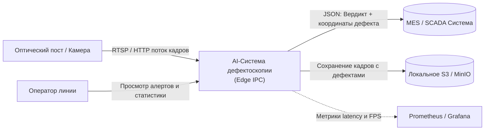
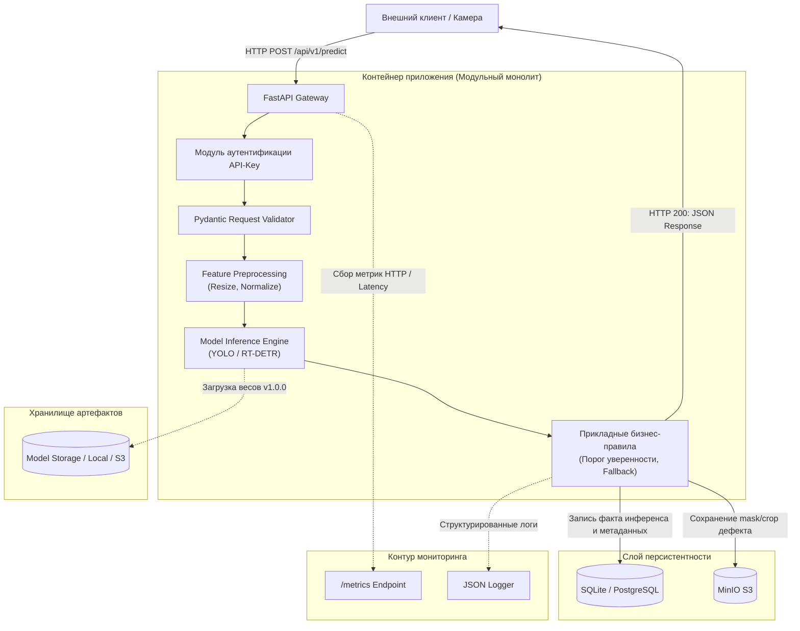

# Система визуального контроля качества продукции (Visual Quality Inspection)

**Авторы:** Сапожникова Анастасия, Жук Валерия  
**Кейс №7:** Дефектоскопия продукции на конвейере  
**Класс задачи ML:** Сегментация дефектов / Классификация качества (Computer Vision, Edge AI)

---

## 1. Контекст и Бизнес-цель

Сервис предназначен для автоматического выявления дефектов готовых изделий (царапины, сколы, деформации, загрязнения) на движущемся конвейере с помощью алгоритмов компьютерного зрения (CV).

**Конечный потребитель:** производственная система (MES/SCADA) и оператор линии.  
**Бизнес-цель:** Снижение процента брака, уходящего к конечному заказчику, за счет 100% автоматического контроля каждой единицы продукции в реальном времени.

---

## 2. Метрики эффективности

### 2.1. Метрики бизнес-процесса
* Снижение доли дефектной продукции, пропускаемой на этап упаковки, до < 0.1%.
* Сокращение времени контроля одной единицы продукции с 15 сек (ручной осмотр) до < 0.05 сек.

### 2.2. Технические метрики (SLA)
* **Задержка (Latency):** p95 < 50 мс (критично из-за скорости движения конвейера).
* **Пропускная способность:** обработка до 20 кадров в секунду (FPS) с одной камеры.
* **Доступность:** 99.9% (работа в режиме 24/7 на локальном Edge-сервере).

### 2.3. Метрики качества модели
* **Recall (Полнота):** > 0.98 (критичнее пропустить дефект, чем ложно браковать годную деталь).
* **Precision (Точность):** > 0.90 (минимизация ложных срабатываний).
* **IoU (Intersection over Union):** > 0.85 для задачи сегментации масок дефектов.

---

## 3. Границы системы (Scope)

### ✅ Входит в систему:
* Прием видеопотока/кадров с оптических постов (RTSP/HTTP).
* Предобработка изображений (нормализация, ресайз).
* Инференс модели детекции/сегментации дефектов.
* Сохранение кадров с дефектами и масок в локальное S3-хранилище (MinIO).
* Отправка алертов и статистики в MES-систему цеха.

### ❌ Не входит в систему:
* Физическая остановка конвейера (система только отправляет сигнал "Reject").
* Настройка аппаратного освещения и калибровка камер.
* Учет готовой продукции в ERP/1С.

---

## 4. Таблица требований

| Тип требования | Формулировка требования | Критерий приемки |
| --- | --- | --- |
| **Функциональное (FR-01)** | Прием кадров для анализа | Эндпоинт `POST /api/v1/predict` принимает изображение (base64) и возвращает вердикт. |
| **Функциональное (FR-02)** | Сохранение артефактов дефектов | При обнаружении дефекта кадр и маска сохраняются в хранилище с привязкой к `timestamp` и `item_id`. |
| **Функциональное (FR-03)** | Fallback на оператора | При уверенности модели confidence < 0.75 выставляется флаг `manual_review_required = true`. |
| **Нефункциональное (NFR-01)** | Производительность (Edge) | Время инференса одного кадра на локальном GPU/CPU не превышает 40 мс. |
| **Нефункциональное (NFR-02)** | Автономность (Offline) | Система работает без доступа в Интернет (локальный инференс, локальное хранилище). |
| **Нефункциональное (NFR-03)** | Воспроизводимость | Каждый ответ содержит `model_version`, `request_id` и координаты bounding box / маски. |
| **Нефункциональное (NFR-04)** | Безопасность | Доступ к эндпоинтам защищен статическим токеном (X-API-Key). |

---

## 5. Контекстная диаграмма (C4 Model — Level 1: System Context)



**Описание потоков:**
* **Камера → Система:** поток JPEG-кадров по HTTP (каждые 50 мс), разрешение 1920×1080.
* **Система → MES:** JSON-сообщение с вердиктом и координатами дефекта (частота — по событию).
* **Система → MinIO:** загрузка артефактов (кадр + маска) по S3 API при обнаружении дефекта.
* **Система → Prometheus:** экспорт метрик по HTTP `/metrics` каждые 15 секунд.

---

## 6. Компонентная диаграмма (C4 Model — Level 2: Container / Component)



---

## 7. Таблица компонентов

| Компонент | Назначение модуля | Входные данные | Выходные данные | Используемые библиотеки |
| --- | --- | --- | --- | --- |
| `app.api.routes` | Обработка HTTP-запросов | HTTP Request | HTTP Response | `fastapi`, `starlette` |
| `app.api.schemas` | Pydantic-схемы валидации | JSON Raw Payload | Строго типизированный объект | `pydantic` |
| `app.ml.preprocessing` | Трансформация изображений | Словарь с изображением | NumPy array / Tensor | `numpy`, `cv2`, `torchvision` |
| `app.ml.inference` | Исполнение инференса модели | Подготовленный Tensor | Числовое предсказание, маски | `onnxruntime`, `torch` |
| `app.services.prediction` | Оркестрация бизнес-правил | Сырой запрос, вердикт модели | Готовый бизнес-результат | Чистый Python |
| `app.repositories` | Персистентность фактов прогноза | Сущность прогноза | Запись в БД | `sqlalchemy`, `aiosqlite` |

---

## 8. Спецификация контрактов REST API

### 8.1. Главный эндпоинт инференса: `POST /api/v1/predict`

**Заголовки:** `Content-Type: application/json`, `X-API-Key: <secret_token>`

**Схема входных данных (Pydantic):**
```python
from pydantic import BaseModel, Field

class PredictionRequest(BaseModel):
    item_id: str = Field(description="Уникальный идентификатор изделия")
    image_base64: str = Field(description="Изображение в формате base64")
    camera_id: str = Field(description="Идентификатор камеры")

    class Config:
        json_schema_extra = {
            "example": {
                "item_id": "ITEM_2026_10_001",
                "image_base64": "iVBORw0KGgoAAAANSUhEUgAA...",
                "camera_id": "CAM_LINE_1_A"
            }
        }
```

**Схема успешного ответа (200 OK):**
```python
from pydantic import BaseModel, Field
from typing import Optional

class PredictionResponse(BaseModel):
    request_id: str = Field(description="Уникальный идентификатор запроса (UUIDv4)")
    item_id: str = Field(description="Идентификатор переданного объекта")
    prediction: str = Field(description="Текстовый вердикт (DEFECT / NORMAL)")
    confidence: float = Field(ge=0.0, le=1.0, description="Вероятность наличия дефекта")
    model_version: str = Field(description="Семантическая версия модели")
    manual_review_required: bool = Field(description="Флаг необходимости проверки оператором")
    defect_mask_url: Optional[str] = Field(default=None, description="Ссылка на маску дефекта в S3")
```

**Пример тела ответа:**
```json
{
  "request_id": "9b1deb4d-3b7d-4bad-9bdd-2b0d7b3dcb6d",
  "item_id": "ITEM_2026_10_001",
  "prediction": "DEFECT",
  "confidence": 0.94,
  "model_version": "1.0.0",
  "manual_review_required": false,
  "defect_mask_url": "s3://defects/2026/10/05/ITEM_2026_10_001_mask.png"
}
```

### 8.2. Системные эндпоинты

**`GET /health`** — проверка состояния сервиса:
```json
{
  "status": "healthy",
  "model_loaded": true,
  "model_version": "1.0.0",
  "uptime_seconds": 3600
}
```

**`GET /metrics`** — выдача метрик для Prometheus в формате OpenMetrics.

---

## 9. Безопасность и наблюдаемость (Observability)

### 9.1. Информационная безопасность
1. **Аутентификация:** доступ к API защищен передачей статического токена в заголовке `X-API-Key`.
2. **Защита от DoS:** ограничение размера полезной нагрузки (Payload Size Limit) до 2 МБ, строгие таймауты запросов.
3. **Приватность (152-ФЗ):** система обрабатывает только технические изображения изделий, персональные данные не собираются и не передаются.

### 9.2. Наблюдаемость и аудит
1. **Формат логов:** структурированное JSON-логирование каждого запроса для сквозной трассировки:
   `{"timestamp": "2026-10-05T12:00:00Z", "level": "INFO", "request_id": "uuid-v4", "item_id": "ITEM_001", "latency_ms": 12.4, "status": 200, "prediction": "NORMAL", "model_version": "1.0.0"}`
2. **Метрики Prometheus:**
   - `http_requests_total` (счетчик запросов по кодам ответа)
   - `http_request_duration_seconds` (гистограмма задержек)
   - `model_inference_duration_seconds` (чистое время инференса)
3. **Контроль дрейфа данных (Data Drift):** сбор логов входящих изображений для периодического offline-анализа статистического расхождения распределений (тесты Колмогорова-Смирнова, PSI через библиотеку `Evidently`).

---

## 10. Архитектурные решения (ADR)

Ключевые решения зафиксированы в отдельных файлах в каталоге [`docs/adr/`](docs/adr/):

* [ADR-01](docs/adr/001-sync-vs-async-inference.md): Выбор синхронного REST API для инференса (обоснование низких задержек для Edge).
* [ADR-02](docs/adr/002-model-storage-strategy.md): Запрет на хранение бинарных весов в Git. Использование локального каталога / MinIO с версионированием через DVC.
* [ADR-03](docs/adr/003-monolith-vs-microservices.md): Выбор модульного монолита в едином Docker-контейнере для упрощения развертывания на Edge-устройствах.

---

## 11. Структура репозитория

```text
ai-system-visual-quality-inspection/
├── .gitignore
├── LICENSE
├── README.md
├── app/
│   ├── __init__.py
│   ├── main.py
│   ├── api/          # Pydantic-схемы и роуты
│   ├── core/         # Конфигурация и логирование
│   ├── data/         # Валидация данных
│   ├── ml/           # ModelLoader, инференс
│   ├── services/     # Бизнес-логика
│   └── repositories/ # Работа с БД
├── docs/
│   └── adr/          # ADR-01, ADR-02, ADR-03
└── tests/
```
